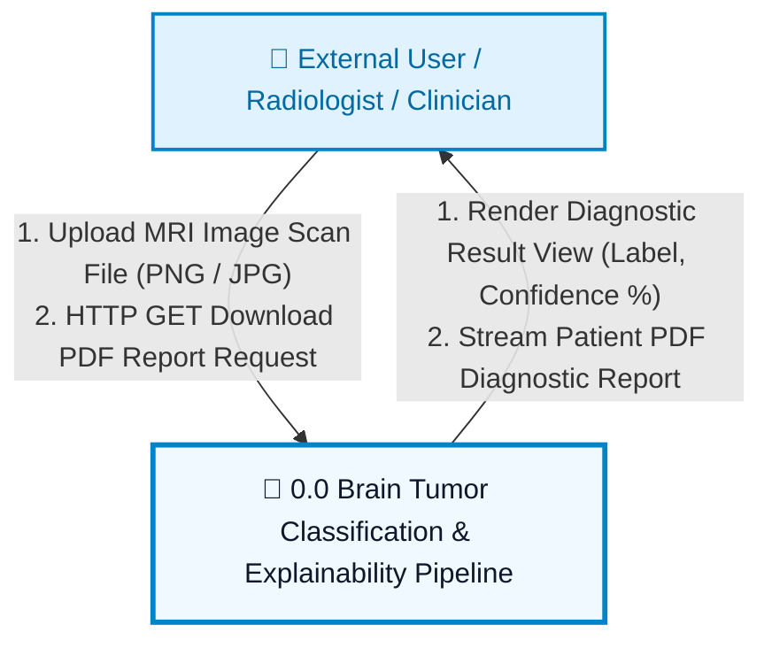
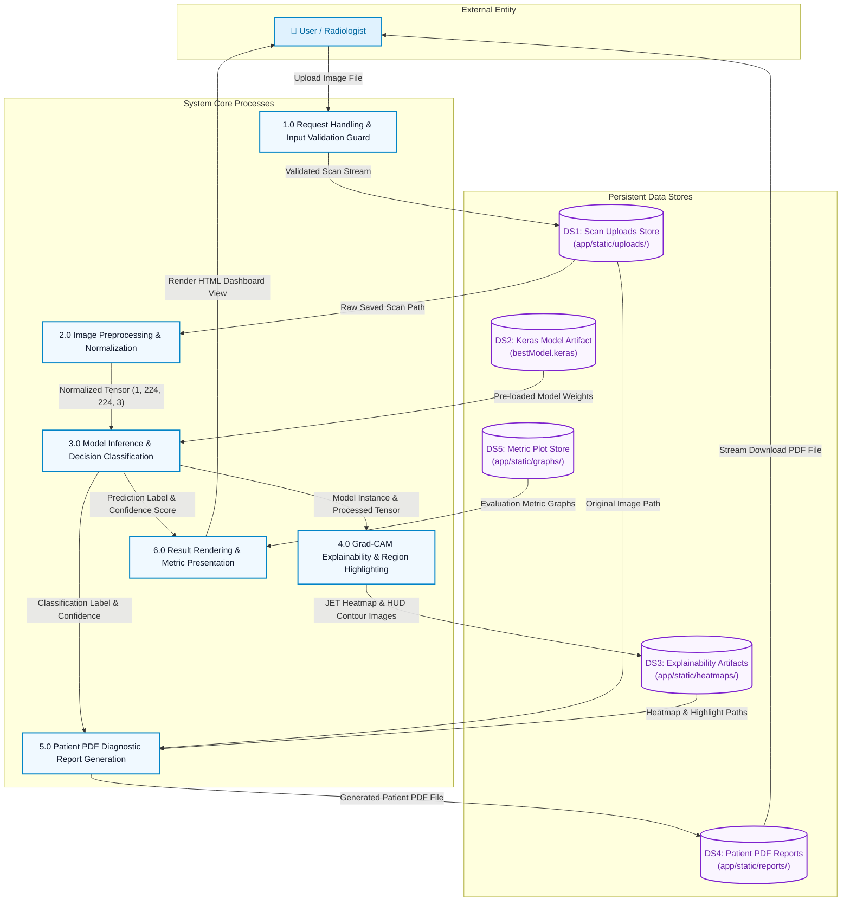
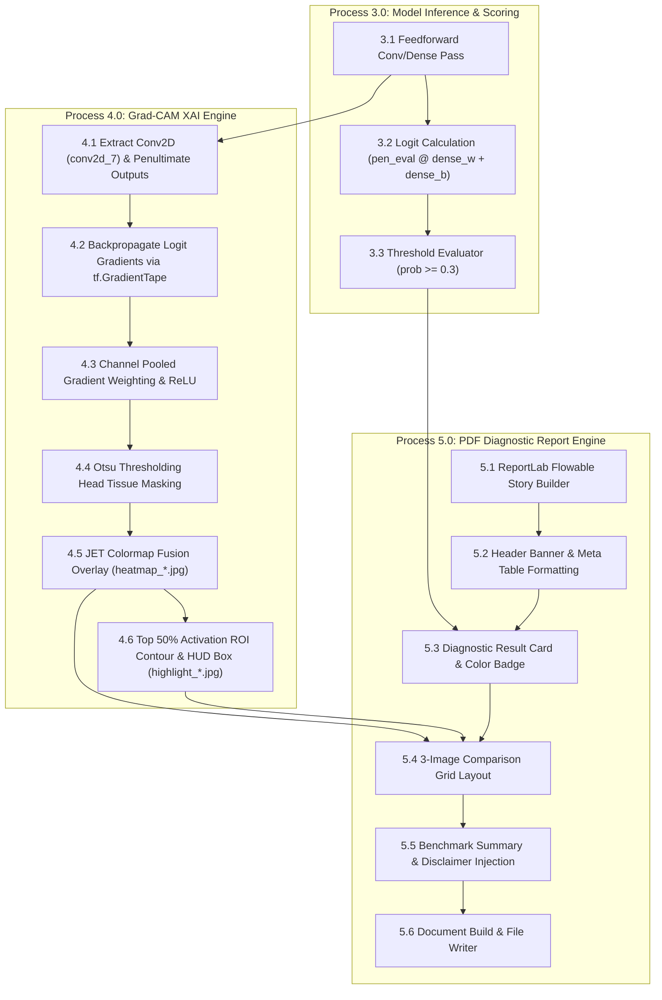
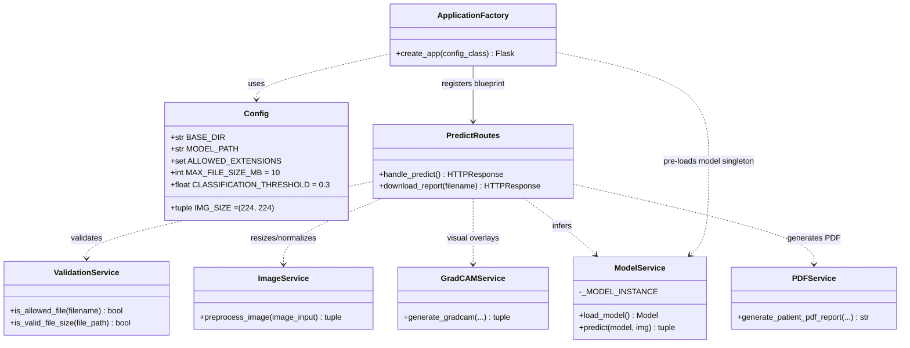
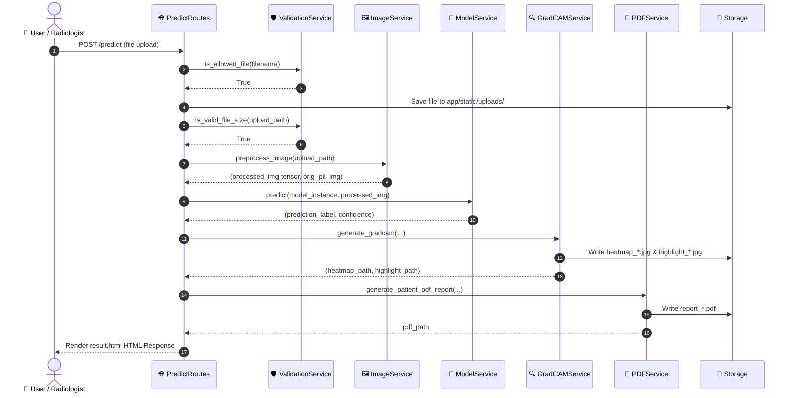

# Brain Tumor Classification System — Architecture & Data Flow Diagrams

> 📸 **Screenshot & Viewing Instructions for RK University Project Report:**
> - **Option 1 (Interactive HTML Diagram Viewer)**: Open [docs/view_diagrams.html](file:///d:/collage%20project/Brain-Tumor-Detection-Model-using-Keras/docs/view_diagrams.html) in Chrome/Edge to view pixel-perfect Mermaid diagrams rendered on a clean white background.
> - **Option 2 (Markdown Preview)**: Open this document ([docs/diagrams.md](file:///d:/collage%20project/Brain-Tumor-Detection-Model-using-Keras/docs/diagrams.md)) in your Markdown Previewer to capture Mermaid diagrams or high-resolution PNG diagram figures directly.

---

## Table of Contents
1. [Data Flow Diagrams (DFD)](#1-data-flow-diagrams-dfd)
   - [1.1 Context Level Data Flow Diagram (DFD Level 0 — Figure 4.1a)](#11-context-level-data-flow-diagram-dfd-level-0--figure-41a)
   - [1.2 Level 1 Data Flow Diagram (DFD Level 1 — Figure 4.1b)](#12-level-1-data-flow-diagram-dfd-level-1--figure-41b)
   - [1.3 Level 2 Data Flow Diagram (DFD Level 2 — Sub-Process Breakdown)](#13-level-2-data-flow-diagram-dfd-level-2--sub-process-breakdown)
   - [1.4 Data Dictionary & Data Flow Mapping](#14-data-dictionary--data-flow-mapping)
2. [High-Level System Class Architecture Diagram](#2-high-level-system-class-architecture-diagram)
   - [2.1 UML Class Architecture Diagram (Figure 4.2)](#21-uml-class-architecture-diagram-figure-42)
   - [2.2 Detailed Class Responsibilities & Design Patterns](#22-detailed-class-responsibilities--design-patterns)
   - [2.3 Component Interaction & Execution Sequence](#23-component-interaction--execution-sequence)

---

## 1. Data Flow Diagrams (DFD)

The Data Flow Diagrams describe how data enters the NeuroScan AI system, transforms across preprocessing, neural network inference, visual explainability engines, report synthesis, and is delivered to the user.

### 1.1 Context Level Data Flow Diagram (DFD Level 0 — Figure 4.1a)

The Level 0 Context Diagram establishes the boundary between the primary external actor (**User / Radiologist / Clinician**) and the single high-level system boundary (**Brain Tumor Classification Pipeline**).

#### 📊 Mermaid Diagram (For Screenshots & Markdown Renderers)



#### 🖼️ Visual Diagram Image


#### 📝 Plain-Text ASCII Diagram

```
+-----------------------------------------------------------------+
|                    USER / RADIOLOGIST                           |
|                    (External Entity)                            |
+-----------------------------------------------------------------+
       |                                                   ^
       | 1. Upload MRI Image (PNG/JPG)                     | 1. Render Result View
       | 2. Request PDF Report                             | 2. Stream PDF Report
       v                                                   |
+-----------------------------------------------------------------+
|     0.0 BRAIN TUMOR CLASSIFICATION & EXPLAINABILITY PIPELINE     |
|   (Flask App + Keras CNN Model + Grad-CAM + ReportLab PDF Engine)|
+-----------------------------------------------------------------+
```

---

### 1.2 Level 1 Data Flow Diagram (DFD Level 1 — Figure 4.1b)

The Level 1 DFD decomposes the system into six core functional processes, highlighting five distinct persistent data stores.

#### 📊 Mermaid Diagram (For Screenshots & Markdown Renderers)



#### 🖼️ Visual Diagram Image


---

### 1.3 Level 2 Data Flow Diagram (DFD Level 2 — Sub-Process Breakdown)

The Level 2 DFD details the deep learning calculation pipeline, visual feature extraction, and report construction sub-processes.



---

### 1.4 Data Dictionary & Data Flow Mapping

| Data Element Name | Data Type | Source Process / Entity | Destination Process / Store | Description |
| :--- | :--- | :--- | :--- | :--- |
| `raw_image_file` | File Stream / Bytes | External User | `1.0 Validation Guard` | Binary image payload uploaded via HTTP POST (`multipart/form-data`). |
| `saved_filename` | String | `1.0 Validation Guard` | `DS1 Uploads Store` | Unique file name string (`<uuid8>_<filename>`). |
| `processed_img` | `numpy.ndarray` (float32) | `2.0 Image Preprocessing` | `3.0 Model Inference` / `4.0 Grad-CAM Engine` | Tensor of shape `(1, 224, 224, 3)` with pixel values scaled to `[0, 1]`. |
| `orig_pil_img` | `PIL.Image` (RGB) | `2.0 Image Preprocessing` | `4.0 Grad-CAM Engine` | Unscaled original RGB image used for visual overlay resizing. |
| `prediction_label` | String | `3.0 Model Inference` | `5.0 PDF Engine` / `6.0 Result View` | Binary diagnosis result: `"Tumor"` or `"No Tumor"`. |
| `confidence` | Float (2 decimal places) | `3.0 Model Inference` | `5.0 PDF Engine` / `6.0 Result View` | Prediction confidence percentage (`0.0%` to `100.0%`). |
| `heatmap_relative_path`| String | `4.0 Grad-CAM Engine` | `DS3 Heatmap Store` / `6.0 Result View` | Relative path to JET colormap overlay (`heatmaps/heatmap_*.jpg`). |
| `highlight_relative_path`| String | `4.0 Grad-CAM Engine` | `DS3 Heatmap Store` / `6.0 Result View` | Relative path to HUD bounding box/contour highlight (`heatmaps/highlight_*.jpg`). |
| `pdf_relative_path` | String | `5.0 PDF Report Engine` | `DS4 Reports Store` / `User` | Relative path to downloadable patient diagnostic PDF (`reports/report_*.pdf`). |

---

## 2. High-Level System Class Architecture Diagram

The system employs a **Modular Service-Oriented Web Architecture (MVC pattern)** built on Flask, with pre-loaded singletons for the deep learning runtime.

### 2.1 UML Class Architecture Diagram (Figure 4.2)

#### 📊 Mermaid Diagram (For Screenshots & Markdown Renderers)



#### 🖼️ Visual Diagram Image


#### 📝 System Architecture Layer Breakdown (ASCII Box Map)

```
+-----------------------------------------------------------------------------------+
|                           APPLICATION CONFIG & FACTORY                            |
|  - Config (IMG_SIZE, MODEL_PATH, CLASSIFICATION_THRESHOLD=0.3, UPLOAD_FOLDER)     |
|  - create_app(Config) -> Flask App Instance (Model pre-loaded on startup)         |
+-----------------------------------------------------------------------------------+
                                         |
                                         v
+-----------------------------------------------------------------------------------+
|                         CONTROLLER BLUEPRINTS (app/routes)                        |
|  - PredictRoutes (/predict, /download_report/<filename>)                          |
|  - MainRoutes (/ index page upload form)                                          |
|  - StatsRoutes (/stats test dataset benchmark metrics & ROC curves)               |
|  - HealthRoutes (/health runtime diagnostics JSON endpoint)                       |
+-----------------------------------------------------------------------------------+
                                         |
       +---------------------------------+---------------------------------+
       |                                 |                                 |
       v                                 v                                 v
+-------------------+          +-------------------+          +-------------------+
| ValidationService |          |   ImageService    |          |   ModelService    |
| - is_allowed_file |          | - preprocess_image|          | - load_model()    |
| - is_valid_size   |          |   (224x224 RGB)   |          | - predict()       |
+-------------------+          +-------------------+          +-------------------+
                                                                           |
       +-------------------------------------------------------------------+
       |                                 |
       v                                 v
+-------------------+          +-------------------+
|  GradCAMService   |          |    PDFService     |
| - JET Heatmap     |          | - ReportLab PDF   |
| - HUD Contour Box |          |   Patient Report  |
+-------------------+          +-------------------+
```

---

### 2.2 Detailed Class Responsibilities & Design Patterns

#### 1. Configuration & Factory (`Config`, `create_app`)
- **Design Pattern**: Application Factory Pattern & Centralized Config.
- **Responsibilities**:
  - `Config`: Centralizes environment configurations, thresholds (`CLASSIFICATION_THRESHOLD = 0.3`), image input shape `(224, 224)`, and folder path structures.
  - `create_app()`: Instantiates the Flask web app, initializes storage directories, pre-loads the Keras model instance into memory on app boot, and registers modular HTTP blueprints.

#### 2. Model Service (`ModelService`)
- **Design Pattern**: Singleton Pattern.
- **Responsibilities**:
  - Maintains `_MODEL_INSTANCE` at module-level scope to avoid re-loading the 67MB `.keras` binary file on every request.
  - `predict()`: Computes raw sigmoid probability output, applies the medical safety margin threshold (`0.3`), and returns formatted classification strings (`"Tumor"` / `"No Tumor"`) and percentage confidence scores.

#### 3. Visual Explainability Engine (`GradCAMService`)
- **Design Pattern**: Strategy & Image Processing Service.
- **Responsibilities**:
  - Constructs a functional model mapping model inputs to the final convolutional layer (`conv2d_7`) and penultimate layer output (`dense_3`).
  - Utilizes `tf.GradientTape` to compute activation map gradients w.r.t linear logits.
  - Calculates channel-pooled weights, applies ReLU, and normalizes feature focus maps.
  - Performs Otsu binary thresholding on original images to generate skull/head tissue masks, preventing background artifact noise.
  - Blends colorized OpenCV JET colormaps for heatmaps (`heatmap_*.jpg`).
  - Isolates top 50% peak focus activation ROIs, generates semi-transparent red highlights, yellow contour boundaries, outer HUD framing brackets, crosshair target reticles, and model attention badges (`highlight_*.jpg`).

#### 4. Diagnostic Report Generator (`PDFService`)
- **Design Pattern**: Flowable Builder Pattern.
- **Responsibilities**:
  - Synthesizes professional single-page patient diagnostic reports using ReportLab (`SimpleDocTemplate`).
  - Assembles styled story elements: Header banner, metadata grid (Report ID, analysis timestamp, model engine), diagnostic result status card (color-coded red/green), 3-image side-by-side comparison grid (Original, Highlight, Heatmap), test performance summary (98% accuracy, 100% recall, 0 false negatives), and medical liability disclaimer.

#### 5. Controller Blueprints (`PredictRoutes`, `StatsRoutes`, `MainRoutes`, `HealthRoutes`)
- **Design Pattern**: MVC Controller / Modular Blueprint Pattern.
- **Responsibilities**:
  - Orchestrates client HTTP requests, form parsing, validation guards, multi-service execution, and template rendering (`index.html`, `result.html`, `stats.html`, `error.html`).

---

### 2.3 Component Interaction & Execution Sequence

#### 📊 Mermaid Sequence Diagram (For Screenshots & Markdown Renderers)


